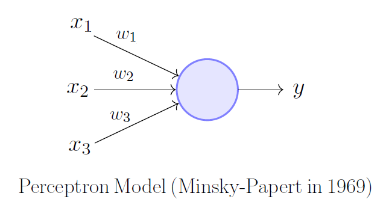
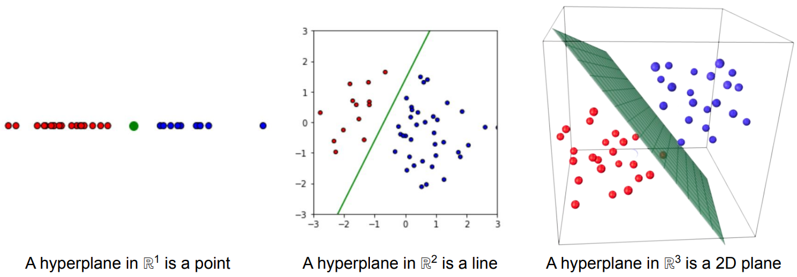

# Basic Perceptron

## Summary:
Purpose: 
Produce one plane in `n-1` dimensional subpace within a R<sup>n</sup> space.
Plane will be used to either:
- Define boundaries in the context of binary classification for linearly sperable clusters.
- Predict continious values for regression where data is homoscedastic.

The visualization for a perceptron is:

<p align="center">

    <br>
    <em>Fig.1 - Single Perceptron.</em>
    
</figure>
</p>

Source: [Akshay L Chandra https://towardsdatascience.com/perceptron-the-artificial-neuron-4d8c70d5cc8d](https://towardsdatascience.com/perceptron-the-artificial-neuron-4d8c70d5cc8d)

<br />

## Quick Maths 

<div>
  &space;0&space;\\1&space;&&space;\text{&space;if&space;}b&plus;\sum_{i}^{}&space;w_{i}x_{i}&space;\leq&space;0\end{cases}">
 <span style='margin-right:1.25em; display:inline-block;'>&emsp; (Equation 1)</span>
</div>

<br />

The equation of the seperating plane itself is: 
<div>
  
 <span style='margin-right:1.25em; display:inline-block;'>&emsp; (Equation 2)</span>
</div>

<br />


The equation can also be written as : 
<div>
  
 <span style='margin-right:1.25em; display:inline-block;'>&emsp; (Equation 3)</span>
</div>

<br />

It simply performs a dot product betewen the inputs and the weights:

<div>
  
 <span style='margin-right:1.25em; display:inline-block;'>&emsp; (Equation 4)</span>
</div>

<br />

The normal to the plane is `(w1,w2,w3...)`. The analytical breakdown of why this is true will be found [here](). This will strengthen the intuition behind the classification problem.  #TODO

Key Features:
- Does not have an activation function.
- Every input has a corresponding weight.
- Every perceptron has a corresponding bias.

```
So what happens when the number of inputs increase? 
```
The **dimensions increases**, however the output remains **single**!


## Dimensionality (R)

As the dimension increases, the seperating plane transforms for a line, to plane, to hyperplane. To be percise, the dimension of the hyperplane is `n-1`, where dimension is R<sup>n</sup>. 

The function of one neuron can be interpreted best in the context of a classification or a regression problem.

Important to note that **the solutions are the same**, both problems produce either a line, plane or hyperplane!
- A perceptron which is trying to classify **is thresholded**, as seen in equation 1, resulting in R<sup>n</sup> dimensional boundary. 
- Output of a perceptron trying to predict is **not thresholded**, as seen in equation 2, resulting in the plane itself.


### Classification Problem
- Produces **one** seperating plane. The seperating plane classifies only **2** classes. 
- Produces a **linear** plane must be linearly sperable. In the context of a classification problem classes must be linearly sepearble. 


<p align="center">

    <br>
    <em>Fig.2 - Dimensional Increase: Classification</em>
</figure>
</p>

<br />

Source: [wellesley.edu/~cs305/lectures/4_Perceptrons](http://cs.wellesley.edu/~cs305/lectures/4_Perceptrons.pdf)


### Regression Problem
- Produces **one** plane.
 In the case of only two inputs it becomes an OLS problem where the output is a line. 
- As the number of inputs increases (dimensions increase), the equation 2 expands out to show that the equation for a [mutliple linear regression](https://aegis4048.github.io/mutiple_linear_regression_and_visualization_in_python).
- Fits best for [homoscedastic and not heteroscedastic](https://timeseriesreasoning.com/contents/heteroscedasticity/) data. 

<br />

<p align="center">

    <br>
    <em>Fig.3 - Dimensional Increase: Regression</em>
</figure>
</p>

Source: [kenndanielso.github.io/mlrefined/blog_posts/8_Linear_regression/8_1_Least_squares_regression.html](https://kenndanielso.github.io/mlrefined/blog_posts/8_Linear_regression/8_1_Least_squares_regression.html)

## Examples 

```
Say you have a cluster of points A and B which exist in two dimensions. How do we feed in the data to a Neural Network, to update the paramters of w and b? 
```
They are learned by iterating through samples of known data points. The **input to a neuron must be a _1D_ vector**. 

`Perceptron Update Rule` is applied:
1. The first iteration looks at the first sample of the data. The x<sub>1</sub> and x<sub>2</sub> are the first value to the input vector. 
2. Random values for the weight and bias are used. 
3. Output is calcuated with the random values using equation 1. 
4. The error is determined. `(Prediction - Truth)`
5. The values of the weights and bias are updated based on the error. w += error *x or b += error 

This same framework can be applied to a regression problem. Only difference is that the output is calculated using equation 2 instead of equation 1.

#TODO
The details of how the error is determined and the values of weights are updates are addressed [here](). 
A notebook which describes the Perceptron Update Rule in detail is [here]().


```
Will the values of weights always converge after training on infinite values from the dataset?  
```
Nope, the data set must be linearly seperable for a classifcation problem and homoscedastic for a regression problem. 

Proof [here]() #TODO

```
Should the threshold value vary depending on the problem? 
```

# Single Layer Multi Perceptron

## Summary:
Purpose: 
Produce **mutliple** planes in `n-1` dimensional subpace within a R<sup>n</sup> space.
Planes will be used to:
- Define boundaries in the context of multi-class classification for linearly seperable clusters**. 

The visualization for a perceptron is:

<p align="center">

    <br>
    <em>Fig.4 - Multiple Perceptron Single Layer.</em>
</figure>
</p>

<br />


## Quick Maths:
The matrix math of Equation 4 can be expanded to accomodate the additional perceptrons, and therefore additional outputs. 

<div>
  
 <span style='margin-right:1.25em; display:inline-block;'>&emsp; (4)</span>
</div>

<br />

Here's a quick refresher on linear algrebra math: 

<p align="center">

    <br>
    <em>Fig.5 - Linear Alegbra Reminder.</em>
</figure>
</p>

Source: [algebra1course.wordpress.com/2013/02/19/3-matrix-operations-dot-products-and-inverses/](https://algebra1course.wordpress.com/2013/02/19/3-matrix-operations-dot-products-and-inverses/)

<br />

<div>
  
 <span style='margin-right:1.25em; display:inline-block;'>&emsp; (4)</span>
</div>

<br />


### Nomenclature: 

**w<sub>(*i*)(*j*)</sub>**  or  **w<sub>(*to*)(*from*)**</sub>

Where __*i*__ is the index of the destination neuron and __*j*__ is the index of the source.  


Key Features: 
- Each perceptron produces an equation for the seperating plane. With two planes, the Neural Network can classify 4 clusters and requires 2 perceptrons. 
- Each additional perceptron will have it's own bias.


###  Classification Problem:

The visualization for the classification problem is:

<p align="center">

    <br>
    <em>Fig.6 - Multiple Perceptron Classification Problem</em>
</figure>
</p>

Source: [jermwatt.github.io/machine_learning_refined/notes/7_Linear_multiclass_classification/7_3_Perceptron.html](https://jermwatt.github.io/machine_learning_refined/notes/7_Linear_multiclass_classification/7_3_Perceptron.html)


```
Can't I just force combinations of the output to change y according to the cluster, thereby allowing curved boundary clusters? 
```

## Limitations of Single Layer Neural Networks: 
- Cannot label unknown curved boundary data
- XOR problem 

# Glossary 

- **Dimensions**: Defined by the number of inputs
- **Weights**: 
- **Bias**: 
- **Linearly seperable**: 
- **Homoscedastic** 
- **Heteroscedasticity**

# External Links

Fig.1 - Perceptron [source Akshay L Chandra](https://towardsdatascience.com/perceptron-the-artificial-neuron-4d8c70d5cc8d)

- http://cs.wellesley.edu/~cs305/lectures/4_Perceptrons.pdf

mutliple linear regression:
- https://aegis4048.github.io/mutiple_linear_regression_and_visualization_in_python
- https://kenndanielso.github.io/mlrefined/blog_posts/8_Linear_regression/8_1_Least_squares_regression.html

homoscedastic & heteroscedasticity - https://timeseriesreasoning.com/contents/heteroscedasticity/

Perceptron Overview 
- http://page.mi.fu-berlin.de/rojas/neural/chapter/K4.pdf
- https://github.com/jermwatt/machine_learning_refined
#TODO: Add citations and sources for notes.